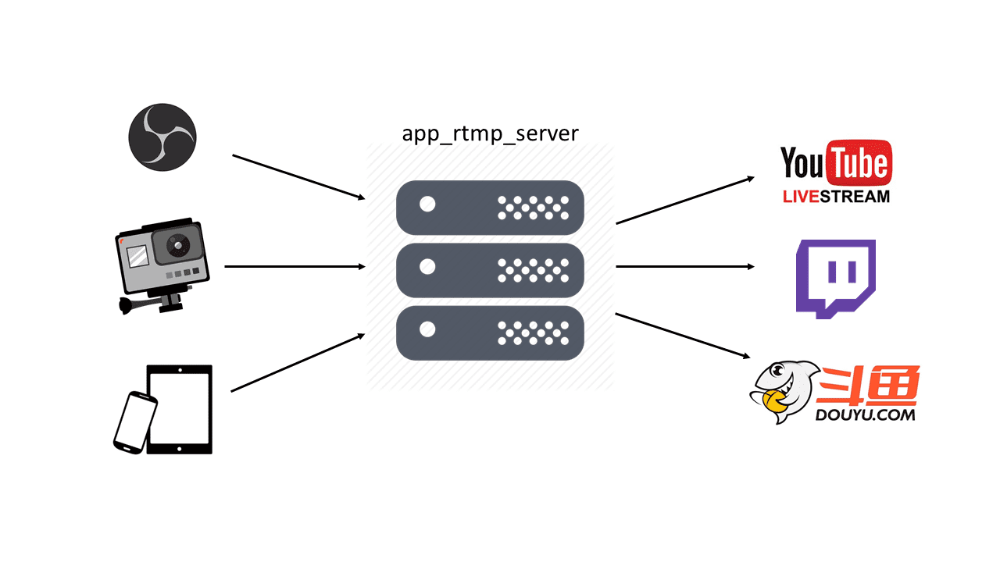

# App Rtmp Proxy

This is an app shared by streaminnology, it is a rtmp proxy, receives rtmp streams and tran forwards to other rtmp servers.

# Supported Platforms
* Linux
* MacOS(INTEL ONLY, NOT SUPPORT ARM)
* Windows(Visual Studio community 2019)

# Build 
* Linux and MacOS
  1. go to MediaEngine/common/3rd, execute build.Linux.sh on Linux or build.MacOS.sh on MacOS to build 3rd library.
  2. go to MediaEngine/application/rtmp_proxy, create build directory in it. enter MediaEngine/application/rtmp_proxy/build.
  3. build 
  ``` shell
  cmake ..
  make
  ```
* Windows
> :warning: :point_right: **YOU MUST RUN IN THE "Developer Command Prompt for VS 2019" NOT cmd.exe**
  1. go to MediaEngine/common/3rd, build 3rd library by the instruction in the build.windows.txt.
  2. go to MediaEngine/application/rtmp_proxy, create build directory in it. enter MediaEngine/application/rtmp_proxy/build.
  3. create visual studio project by cmake 
  ``` shell
  cmake ..
  ```
  4. open app_rtmp_proxy.sln in the MediaEngine/application/rtmp_proxy/build.

# Configuration
Configuration file is in the MediaEngine/application/rtmp_proxy/conf directory.
```json
{
  "name":"rtmp proxy",
  "version":1,
  "rtmp_port":1935,
  "proxy":[
    {
      "application_name":"live",
      "stream_name":"alpes",
      "publish_to":[
        { "publish_name":"publish_name", "publish_url":"rtmp://192.168.1.252:1937/app/alpes" }
      ]
    },
    {
      "application_name":"live",
      "stream_name":"travel_europe",
      "publish_to":[
        { "publish_name":"publish_name_1", "publish_url":"rtmp://192.168.1.252:1937/app/travel_europe_1" },
        { "publish_name":"publish_name_2", "publish_url":"rtmp://192.168.1.252:1937/app/travel_europe_2" },
        { "publish_name":"publish_name_3", "publish_url":"rtmp://192.168.1.252:1937/app/travel_europe_3" },
        { "publish_name":"publish_name_4", "publish_url":"rtmp://192.168.1.252:1937/app/travel_europe_4" }
      ]
    }
  ]
}
```
Suppose app_rtmp_server runs on a server whose ip address is *YOUR_IP_ADDRESS*.

rtmp_port is the listening port of this app_rtmp_server. There are two input streams need to forward, one is *rtmp://YOUR_IP_ADDRESS:rtmp_port/live/alpes* and the other is *rtmp://YOUR_IP_ADDRESS:rtmp_port/live/travel_europe*.

* If there is rtmp stream goes to *rtmp://YOUR_IP_ADDRESS:rtmp_port/live/alpes*, app_rtmp_server will forward this stream to this address: 
  1. *rtmp://192.168.1.252:1937/app/alpes*

* If there is rtmp stream goes to *rtmp://YOUR_IP_ADDRESS:rtmp_port/live/travel_europe*, app_rtmp_server will forward this stream to these 4 addresses:
  1. *rtmp://192.168.1.252:1937/app/travel_europe_1*
  2. *rtmp://192.168.1.252:1937/app/travel_europe_2*
  3. *rtmp://192.168.1.252:1937/app/travel_europe_3*
  4. *rtmp://192.168.1.252:1937/app/travel_europe_4*
